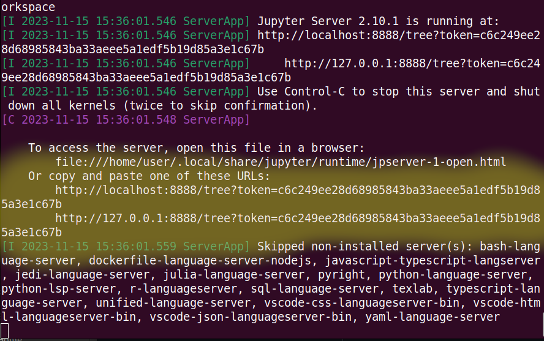

# Universal ML-Template

This comprehensive template is designed to facilitate the development of machine learning projects using a variety of tools and frameworks. Whether you're a beginner or an experienced ML practitioner, this template provides a structured and efficient approach to building and deploying ML models.

### Quick Start Guide
1. **Setting Up Your Environment**
    - **Install Docker**: Follow the instructions in [INSTALL.md](./docs/INSTALL.md) to set up Docker on your machine.
    - **OpenAI API Keys (Optional)**: If you plan to integrate OpenAI's APIs, set up your API keys as described in the installation guide.

2. **Understanding the Philosophy**
    - **Template Philosophy**: Gain insights into the design and purpose of this template by reading [PHILOSOPHY.md](./docs/PHILOSOPHY.md).

3. **Running Examples**
    - **Access Pre-Built Examples**: Explore practical examples in the [examples](./examples/) folder to jump-start your project.
    - **Set Up the Docker Image**:
        - Run `bash start.sh`.
        - When asked if you want to run open-interpreter, say no. answer everything else normally.
        - Open the Jupyter Notebook link (e.g., `localhost...`) and navigate to the examples folder.

4. **Building Your Own Models**
    - **Using TensorFlow or PyTorch**: Tutorials for creating custom models using popular frameworks are available at [./notebooks/README.md](./notebooks/README.md).

5. **Leveraging [Open-Interpreter](https://github.com/KillianLucas/open-interpreter/) for Model Creation**
    - We do this within a docker container for the safety of your local machine, but also to allow for a 'clean' environment to install and experiment with new dependencies.
    - **Automate Model Creation with GPT-4**:
        - Initialize the Docker image with `bash start.sh` and when asked say `y` that you want to run open interpreter.
        - Input commands to the interpreter, e.g., _"create a dummy dataset of 10 statements often associated with republicans, democrats, libertarians and socialists then write me a deep neural network in pytorch using torchvision to classify those statements, write the training loop and also test the model on a new statement."_
        - Exit the interpreter by pressing `CTRL-C`.

### Additional Features
- **Comprehensive Documentation**: Each step of the process is well-documented to ensure a smooth user experience.
- **Modular Design**: The template's modular structure allows for easy customization and expansion to fit specific project needs.
- **Community Support**: Engage with the community for troubleshooting, tips, and sharing best practices. Join us at [https://discord.gg/medusaml](https://discord.gg/medusaml)

### TODO
fix torchtext and test with tensorflow.
